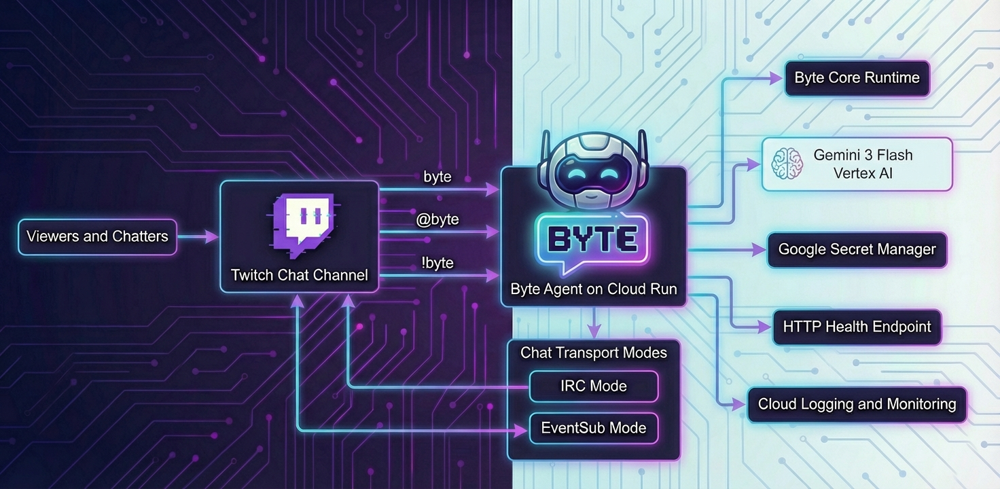

# Byte - Twitch AI Chat Agent

[](bot/requirements.txt)
[](deploy.sh)
[](docs/DOCUMENTATION.md#4-operating-modes)
[](docs/DOCUMENTATION.md#91-reply-length)
[](docs/INDEX.md)
[](LICENSE)


`Byte` is a Twitch chat agent powered by Gemini 3 Flash (Vertex AI) and deployed on Cloud Run.

## Architecture



## What Byte Does

- Joins Twitch chat as a viewer (`irc`) or official cloud chatbot (`eventsub`).
- Responds to natural trigger messages like `byte ...`, `@byte ...`, or `!byte ...`.
- Keeps answers concise for live chat (hard limit: 4 lines per message).
- Handles direct questions, movie fact-sheet prompts, and current-events prompts.
- Enforces one-message contract for serious/technical prompts (max 4 lines, high density).

## Chat Commands and Trigger Patterns

- `byte help`
- `byte status`
- `byte movie fact sheet <movie>`
- `byte what is the movie fact sheet for what we are watching?`
- `byte <free-form question>`

Also supported:

- `@byte <question>`
- `!byte <question>`

IRC owner-only channel management:

- `byte canais` / `byte channels`
- `byte join <channel_login>`
- `byte part <channel_login>`
- Dashboard channel control: `list`, `join <channel_login>`, `part <channel_login>` (IRC only)

## Operating Modes

### `TWITCH_CHAT_MODE=irc` (recommended for demos)

- Connects with user token as a regular viewer account.
- No streamer authorization required for basic read/reply behavior.
- Typical scopes: `chat:read`, `chat:edit`.
- Supports multiple channels:
  - Static config: `TWITCH_CHANNEL_LOGINS=channel_a,channel_b`
  - Runtime updates from chat (owner-only): `byte join ...` / `byte part ...`

### `TWITCH_CHAT_MODE=eventsub` (official cloud path)

- Official Twitch cloud chatbot architecture.
- For third-party channels, broadcaster authorization is required.
- Typical scopes:
  - Bot account: `user:read:chat`, `user:write:chat`, `user:bot`
  - Broadcaster account: `channel:bot`

## Quick Start

1. Copy `.env.example` into `.env` and fill required values.
2. Install dependencies: `pip install -r bot/requirements.txt`.
3. Run locally: `python bot/main.py`.
4. Deploy on Cloud Run: `./deploy.sh`.

For dashboard admin controls in Cloud Run, set:

- `BYTE_DASHBOARD_ADMIN_TOKEN_SECRET_NAME=byte-dashboard-admin-token`

## Cloud Run Notes

- The container listens on `0.0.0.0:$PORT`.
- Health endpoint: `GET /`.
- Recommended timeout for long-lived chat connections: `3600s`.

## Real-Time Observability

- Dashboard UI: `GET /dashboard`
- JSON snapshot API: `GET /api/observability`
- Channel control API: `POST /api/channel-control` (requires `X-Byte-Admin-Token`)
- Control plane API: `GET|PUT /api/control-plane` (requires `X-Byte-Admin-Token`)
- Action queue API: `GET /api/action-queue` and `POST /api/action-queue/<id>/decision` (requires `X-Byte-Admin-Token`)
- Manual autonomy tick: `POST /api/autonomy/tick` (requires `X-Byte-Admin-Token`)
- Health probe: `GET /` or `GET /healthz`

The dashboard is intentionally lightweight (vanilla HTML/CSS/JS) and shows:

- Live counters (messages, triggers, interactions, replies, errors).
- Active chatters and latency (`avg` / `p95`).
- Route distribution, context state, timeline (30 min), and recent events.
- Channel control mode-aware (IRC vs EventSub), autonomy runtime, risk queue, and outcome/cost KPIs.

## Cost Snapshot and Monthly Estimate

Run live usage + projected monthly estimate (Cloud Run + Gemini):

```bash
CLOUD_RUN_SERVICE=byte-bot \
REGION=us-central1 \
GEMINI_MODEL_FILTER=gemini-3-flash-preview \
./scripts/estimate_monthly_cost.sh
```

Run an end-of-day snapshot:

```bash
START_TIME="$(date -u +%Y-%m-%dT00:00:00Z)" \
END_TIME="$(date -u +%Y-%m-%dT23:59:59Z)" \
CLOUD_RUN_SERVICE=byte-bot \
REGION=us-central1 \
GEMINI_MODEL_FILTER=gemini-3-flash-preview \
./scripts/estimate_monthly_cost.sh
```

## Documentation

- [Documentation hub](docs/INDEX.md)
- [Complete product + ops guide](docs/DOCUMENTATION.md)
- [Executable implementation plan (agent + dashboard parity)](docs/IMPLEMENTATION_PLAN_EXECUTAVEL_PARIDADE_AGENT_DASHBOARD.md)
- [Visual asset direction for GitHub](docs/GITHUB_VISUAL_ASSETS_2026.md)

## Security

- Do not commit `.env`, tokens, or client secrets.
- Prefer Secret Manager for `TWITCH_CLIENT_SECRET`.
- Check pending files before push: `git status --short`.

## License

This project is open source under the MIT license. See `LICENSE`.

## Self-Host

Anyone can deploy Byte in their own GCP project using `deploy.sh`.
