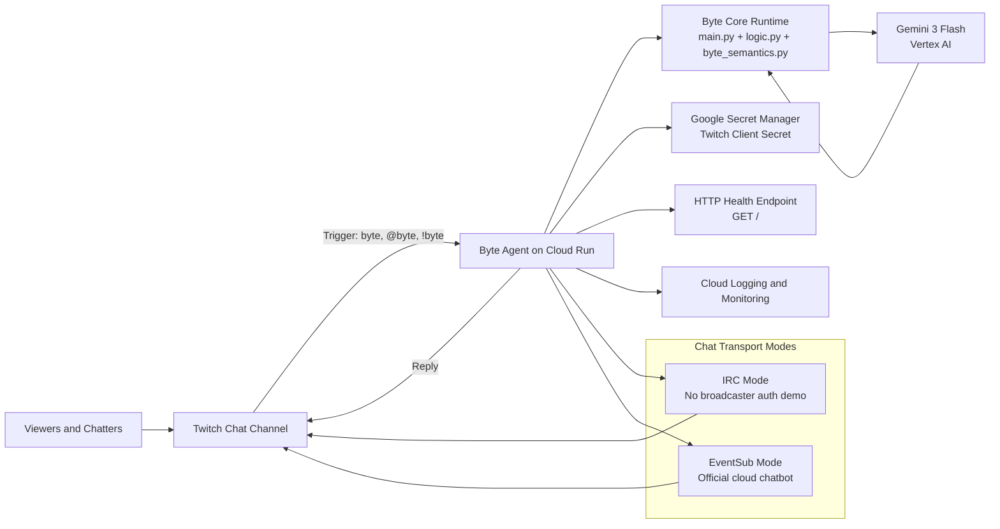

# Byte - GitHub Visual Assets Guide (2026)

Goal: define a visual kit that makes `Byte` look premium, technical, and clearly built for live streaming.

Related docs:

- [Documentation index](INDEX.md)
- [Project README](../README.md)
- [Complete product guide](DOCUMENTATION.md)

## Quick Benchmark (Observed Repo Patterns)

References reviewed:

- `sogebot/sogeBot`: strong badge strip + screenshots + community links above the fold.
- `ardha27/AI-Waifu-Vtuber`: hero screenshot plus short video/demo block.
- `open-sauced/beybot`: short GIF showing real chat interaction.
- `Koischizo/AI-Vtuber`: clickable demo thumbnails to reduce user friction.
- `Kichi779/Twitch-Chat-Bot`: visual onboarding with guided GIF previews.
- `AkagawaTsurunaki/ZerolanLiveRobot`: capability/badge wall for instant positioning.

## What Sells Better on GitHub

1. Strong hero visual at the top with project value proposition.
2. Real proof in 3-8 seconds (short chat loop GIF).
3. Simple architecture image (Twitch -> Byte -> Gemini -> chat reply).
4. Command cards with high-impact examples.
5. Production proof screenshot (Cloud Run revision/status).
6. Consistent visual identity (palette + typography + tone).

## Recommended Asset Kit for Byte

```text
assets/
  hero-banner-byte.png
  demo-chat-loop.gif
  architecture-byte-flow.png
  command-cards.png
  cloudrun-proof.png
  social-cover-1280x640.png
```

Suggested dimensions:

- `hero-banner-byte.png`: `1600x900`
- `demo-chat-loop.gif`: `1280x720` (5-8 seconds, loop)
- `architecture-byte-flow.png`: `1920x1080`
- `command-cards.png`: `1600x900`
- `cloudrun-proof.png`: `1600x900`
- `social-cover-1280x640.png`: `1280x640`

## Recommended README Visual Order

1. Hero banner + one-line positioning.
2. Demo GIF (real chat trigger + reply).
3. "How it works" architecture diagram.
4. Command cards.
5. Production proof image and docs links.

## Ready-to-Use Prompts for Image Generation

Use this base style in every prompt:

`cinematic tech visual style, clean UI overlays, high contrast, premium streaming brand, playful hacker energy, no third-party logos, legible text, horizontal 16:9 composition`

### 1) Hero Banner

`Create a 16:9 hero banner for a Twitch AI agent named Byte. Theme: premium AI co-host with sharp humor. Scene: futuristic control desk with live chat panels, low-latency telemetry, and Gemini flow signals. Palette: cyan, electric blue, graphite, neon green accents. Keep clean negative space on the left for title text. No trademarked logos.`

### 2) Demo Chat Loop Cover

`Create a 16:9 Twitch chat scene focused on a real trigger message "byte status" and a short, precise bot reply. Modern stream overlay aesthetic, gamer-tech language, high readability, visible speed and reliability mood.`

### 3) Architecture Visual

`Create a minimal 16:9 technical diagram with flow: Twitch Chat -> Byte Agent -> Gemini 3 Flash (Vertex AI) -> Chat Reply -> Cloud Run. Use generic icons, clean arrows, clear hierarchy, premium technical style, graphite background with subtle neon cyan lines.`

### Mermaid Architecture Blueprint

Use this Mermaid code as the canonical architecture map for visual generation:



### 4) Command Cards

`Create a 16:9 panel with four visual command cards: "byte help", "byte status", "byte movie fact sheet", "byte <question>". Futuristic UI style, rounded corners, micro-illustrations, strong contrast, ready for README embedding.`

### 5) Production Proof

`Create a 16:9 operations dashboard scene showing stable cloud deployment: online status, uptime, active revision, clean logs, and chat replies in production. Serious and reliable visual tone, no tiny unreadable text.`

### 6) Social Cover

`Create a 1280x640 social preview cover for the Byte Twitch AI bot project. Elements: abstract bot mascot, chat bubbles, AI inference flow, premium plus playful tone, bold typography area with room for a clear title.`

## Quality Rules (Avoid Weak Visuals)

1. Avoid text-heavy images.
2. Focus each image on one message.
3. Keep one consistent palette across all assets.
4. Validate readability on mobile thumbnails.
5. Generate at least 3 variants per prompt and keep the cleanest one.
